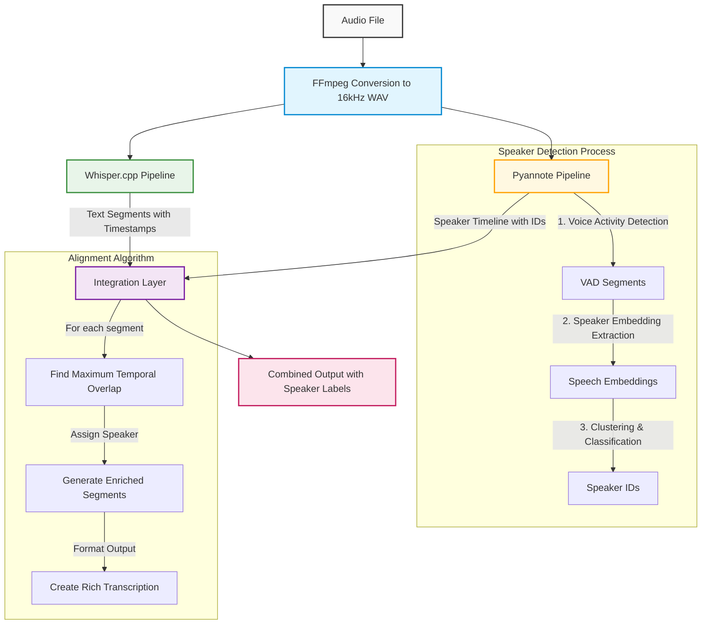

# Local Speech-To-Text

This project provides a FastAPI web service for offline transcription and diarization using whisper.cpp, allowing you to run high-quality speech recognition locally without sending data to external services.


## Demo

https://github.com/user-attachments/assets/99068a21-f617-43bd-bb06-0ed052f75a9b

## Key Features

- **Web UI**: Easy-to-use web interface for transcription and diarization
- **API Access**: RESTful API for programmatic access
- **Multiple Models**: Support for various model sizes (tiny, base, small, medium, large)
- **Diarization**: Speaker segmentation using pyannote/speaker-diarization-3.1, a state-of-the-art diarization system
- **Offline Operation**: All processing happens locally, no data leaves your machine
- **On-demand Model Downloads**: Automatic model management with visual indicators for download status
- **Support for Various Audio Formats**: Through FFmpeg integration

## Prerequisites

1. **whisper.cpp** - The service expects `whisper-cli` binary to be available in your PATH or configured via environment variables
2. **FFmpeg** - Required for audio conversion
3. **Python 3.8+** - Required to run the FastAPI service
4. **Hugging Face Token** - Required for advanced speaker diarization using pyannote.audio (optional)

## Quick Start

### Native Installation

1. Clone this repository:
   ```bash
   git clone https://github.com/yourusername/whispercpp-experimental.git
   cd whispercpp-experimental
   ```

2. You have several options to set up the service:

   **Option 1: Complete setup (recommended for first-time users)**
   ```bash
   # Creates virtual environment, installs dependencies,
   # builds whisper.cpp, creates symlink, and downloads base models
   make setup-all
   ```

   **Option 2: Step-by-step setup**
   ```bash
   # Create a virtual environment (optional)
   make venv
   
   # Install Python dependencies
   make install
   
   # Build whisper.cpp from source
   make build-whisper
   
   # Create a symlink to whisper-cli
   make link-whisper
   
   # Download specific models (e.g., base.en, small.en)
   make download-model MODEL=base.en
   ```

3. Run the service:
   ```bash
   make start
   ```

4. Open your browser and go to `http://localhost:8000`

5. Additional commands:
   ```bash
   # List available models
   make models
   
   # Stop the running service
   make stop
   
   # Clean temporary files
   make clean
   ```

## Configuration

### Environment Variables

The service can be configured using environment variables. You can set them directly or through a `.env` file (recommended):

1. Copy the example configuration file:
   ```bash
   cp .env.example .env
   ```

2. Edit the `.env` file to customize settings:
   ```
   # Whisper.cpp Configuration
   WHISPER_BIN_PATH=whisper-cli  # Path to the whisper.cpp binary
   DEFAULT_MODEL=base.en         # Default model to use for transcription

   # Speaker Diarization Configuration
   HF_TOKEN=your_token_here      # Hugging Face token for pyannote/speaker-diarization

   # Server Configuration
   HOST=0.0.0.0                  # Host to bind the server to
   PORT=8000                     # Port to run the server on
   DEBUG=false                   # Enable debug mode (true/false)
   ```

### Key Configuration Options

- `WHISPER_BIN_PATH`: Path to the whisper-cli binary (default: looks in PATH)
- `DEFAULT_MODEL`: The default model to use (default: "base.en")
- `HF_TOKEN`: Hugging Face access token for using pyannote/speaker-diarization (required for advanced diarization)
- `HOST`: The host address to bind the server to (default: "0.0.0.0")
- `PORT`: The port number to run the service on (default: 8000)
- `DEBUG`: Enable debug mode with auto-reload on file changes (default: false)

## Kaggle Dataset Integration

This project integrates with Kaggle's datasets API to automatically download and use the [mini-speech-diarization](https://www.kaggle.com/datasets/wiradkp/mini-speech-diarization) dataset for testing and development purposes.

### Dataset Features

- Pre-segmented audio files with speaker labels
- Various conversational scenarios for testing diarization
- Available through the `/kaggle-dataset` API endpoint
- Automatically downloaded on service startup if credentials are provided

### Configuration

1. Get Kaggle API credentials from [Kaggle Settings](https://www.kaggle.com/settings) (Create New API Token)
2. Add them to your `.env` file:
   ```
   KAGGLE_USERNAME=your_kaggle_username
   KAGGLE_KEY=your_kaggle_api_key
   ```

### Accessing Dataset Information

The dataset and its files can be viewed:
- In the web UI on the main page
- Via the `/kaggle-dataset` API endpoint
- Used for testing diarization capabilities

## Available Models

The service supports all models provided by whisper.cpp:

| Model | Size | Memory Required | Relative Speed | Languages |
|-------|------|-----------------|----------------|-----------|
| tiny.en | 75 MB  | ~273 MB | Fastest | English only |
| base.en | 142 MB | ~388 MB | Fast | English only |
| small.en | 466 MB | ~852 MB | Moderate | English only |
| medium.en | 1.5 GB | ~2.1 GB | Slow | English only |
| large | 2.9 GB | ~3.9 GB | Slowest | Multilingual |

Each model is available in English-only variants (e.g., `tiny.en`) which are generally faster and more accurate for English content. For multilingual support, use models without the `.en` suffix.

> **Note:** All models can now be used with speaker diarization through the pyannote integration, regardless of model type or language support.

## Speaker Diarization with Pyannote

This project utilizes [pyannote/speaker-diarization-3.1](https://huggingface.co/pyannote/speaker-diarization-3.1), a state-of-the-art speaker diarization system from Hugging Face to add speaker identification capabilities to whisper.cpp transcriptions. The 3.1 version offers improved performance with pure PyTorch implementation (no onnxruntime dependency).

> **Note:** The tinydiarize feature (models with `-tdrz` suffix) is no longer available in recent whisper.cpp versions. Our system now exclusively uses the pyannote integration for all speaker diarization needs.

### Integration Architecture



### Technical Implementation 

#### 1. Pipeline Components

- **Whisper.cpp Transcription Engine**:
  - Handles speech-to-text conversion
  - Provides timestamped text segments
  - Works with any whisper.cpp model (tiny through large)
  - Supports multiple languages based on model capabilities

- **Pyannote Speaker Diarization**:
  - Identifies unique speakers in the audio
  - Creates a timeline of who speaks when
  - Can work with known or unknown number of speakers
  - Requires a Hugging Face access token

#### 2. Data Flow & Integration

1. **Parallel Processing**:
   - Audio is processed simultaneously by both whisper.cpp and pyannote
   - Both systems work on the same 16kHz WAV file created by FFmpeg
   - Results are merged after both processes complete

2. **Advanced Alignment Algorithm**:
   ```python
   def align_diarization_with_transcription(diarization_result, transcription_segments):
       # For each transcription segment
       for segment in transcription_segments:
           # Get start/end times
           start, end = segment["start"], segment["end"]
           
           # Find all speaker turns that overlap with this segment
           overlapping_speakers = {}
           for speaker_segment in diarization_result["segments"]:
               overlap = calculate_overlap(segment, speaker_segment)
               if overlap > 0:
                   speaker = speaker_segment["speaker"]
                   overlapping_speakers[speaker] = overlapping_speakers.get(speaker, 0) + overlap
           
           # Assign the speaker with maximum overlap
           if overlapping_speakers:
               segment["speaker"] = max(overlapping_speakers.items(), key=lambda x: x[1])[0]
       
       return transcription_segments
   ```

3. **Output Structure**:
   - Original transcription with added speaker labels
   - Formatted speaker-labeled text for better readability
   - Timestamped segments with speaker information
   - Metadata about number of speakers detected

#### 3. Tuning Options

The system supports several parameters to tune the diarization process:

- **num_speakers**: Exact number of speakers when known
- **min_speakers**: Lower bound for speaker count
- **max_speakers**: Upper bound for speaker count
- **language**: Language code to help transcription accuracy

### Advantages of Pyannote Integration

- **Language Agnostic**: Works with any language supported by the whisper model
- **High Accuracy**: State-of-the-art speaker identification performance
- **Flexible Speaker Count**: Can auto-detect speaker count or work with constraints
- **Clean Output Format**: Produces both human-readable and machine-parseable outputs
- **Perfect for Meetings**: Excels at distinguishing multiple speakers in conversation

To use the advanced diarization:

1. Get a Hugging Face token from [Hugging Face](https://huggingface.co/settings/tokens)
2. Accept the user agreement for [pyannote/speaker-diarization-3.1](https://huggingface.co/pyannote/speaker-diarization-3.1)
3. Set the `HF_TOKEN` environment variable before starting the service:
   ```bash
   export HF_TOKEN="your_hugging_face_token_here"
   ```
   
The service automatically selects the appropriate diarization method based on the model and available dependencies.

## Using the Web Interface

1. Browse to `http://localhost:8000`
2. The interface shows:
   - Audio file upload section
   - Model selection dropdown
   - Speaker diarization toggle
   - Available models section with download buttons

3. To transcribe:
   - Upload an audio file
   - Select a model (must be downloaded first)
   - Enable diarization if needed and if the model supports it
   - Click "Transcribe Audio"

4. The transcription results will show:
   - Full transcription text
   - Segments with timestamps
   - Speaker turns highlighted (if diarization was enabled)

## API Usage

### API Documentation

Full API documentation is available at:
- Swagger UI: http://localhost:8000/docs
- ReDoc: http://localhost:8000/redoc

### List available models:

```bash
curl -X GET http://localhost:8000/models
```

Example response:
```json
[
  {
    "name": "base.en",
    "path": "models/ggml-base.en.bin",
    "supports_diarization": true,
    "is_downloaded": true
  },
  {
    "name": "small.en",
    "path": "models/ggml-small.en.bin",
    "supports_diarization": true,
    "is_downloaded": true
  }
]
```

### Download a model:

```bash
curl -X POST http://localhost:8000/models/small.en/download
```

### Transcribe an audio file:

Basic usage without speaker diarization:
```bash
curl -X POST http://localhost:8000/transcribe \
  -F "audio_file=@example.mp3" \
  -F "model=base.en" \
  -F "enable_diarization=false"
```

With speaker diarization (works with any model):
```bash
curl -X POST http://localhost:8000/transcribe \
  -F "audio_file=@example.mp3" \
  -F "model=base.en" \
  -F "enable_diarization=true"
```

With specified number of speakers:
```bash
curl -X POST http://localhost:8000/transcribe \
  -F "audio_file=@meeting.mp3" \
  -F "model=medium" \
  -F "enable_diarization=true" \
  -F "num_speakers=3"  # Optional: specify exact number of speakers
```

With pyannote speaker diarization using speaker range:
```bash
curl -X POST http://localhost:8000/transcribe \
  -F "audio_file=@meeting.mp3" \
  -F "model=medium" \
  -F "enable_diarization=true" \
  -F "min_speakers=2" \
  -F "max_speakers=5"  # Optional: specify range of speakers
```

Specifying a language (using Vietnamese as an example):
```bash
curl -X POST http://localhost:8000/transcribe \
  -F "audio_file=@vietnamese_speech.mp3" \
  -F "model=medium" \
  -F "language=vi" \
  -F "enable_diarization=true"
```

## Development

### Linting and Code Quality

You can run all linters at once with:
```bash
make lint
```

To automatically format your code:
```bash
make format         # Runs black and isort to format code
```

## Project Structure

- `src/`: Python source code for the FastAPI service
  - `main.py`: FastAPI application entry point
  - `model_manager.py`: Manages whisper.cpp models
  - `transcription_service.py`: Interfaces with whisper.cpp
  - `static/`: Contains web UI files
- `models/`: Directory for downloaded whisper models
- `temp_uploads/`: Temporary storage for uploaded files
- `run_service.sh`: Script to run the service locally

## Contributing

Contributions are welcome! Please feel free to submit a Pull Request.

## License

This project is licensed under the MIT License - see the LICENSE file for details.

## Acknowledgements

- [whisper.cpp](https://github.com/ggml-org/whisper.cpp): High-performance inference of OpenAI's Whisper model
- [TinyDiarize](https://github.com/akashmjn/tinydiarize): Speaker diarization extension for whisper.cpp
- [Pyannote Audio](https://github.com/pyannote/pyannote-audio): Speaker diarization toolkit
- [FastAPI](https://fastapi.tiangolo.com/): Modern web framework for building APIs
- [FFmpeg](https://ffmpeg.org/): Multimedia framework for audio/video processing
